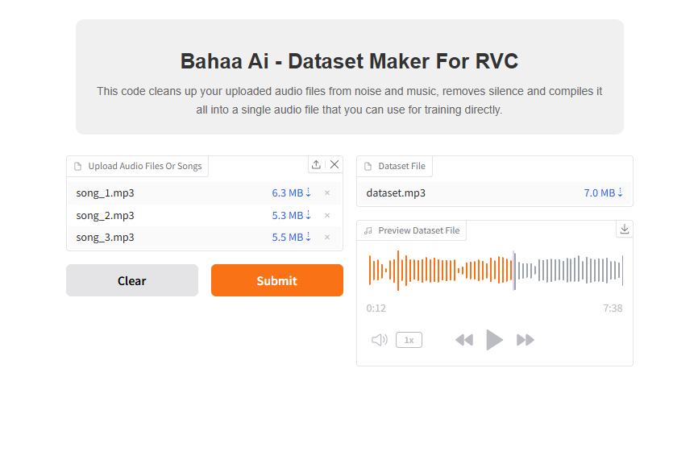

# Dataset Maker for RVC - [Bahaa Ai](https://www.youtube.com/@BahaaAI)
This tool cleans up your uploaded audio files from noise and music, removes silence, and compiles them into a single dataset audio file for training RVC models.

* **This code is for creating the audio file that you will train your audio model on using RVC.**
* **This code is suitable for creating a dataset file from songs or regular audio recordings.**
  
## Features
- Extract vocals from uploaded audio files or songs.
- Remove silence from audio.
- Merge all uploaded audio files into one mp3 file.

  

  
